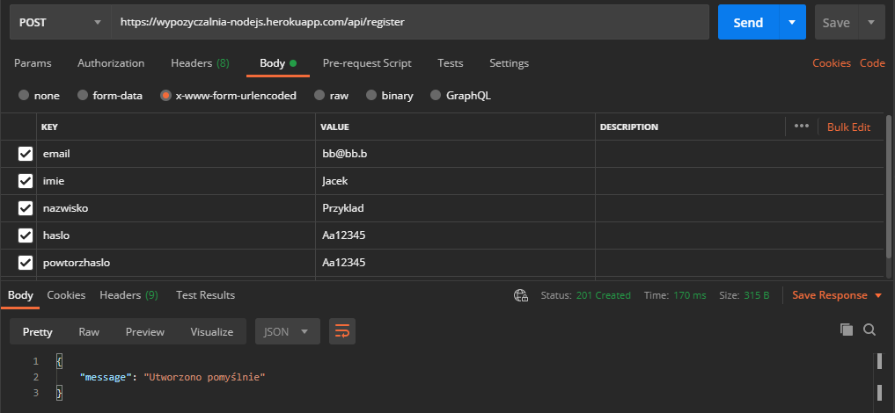
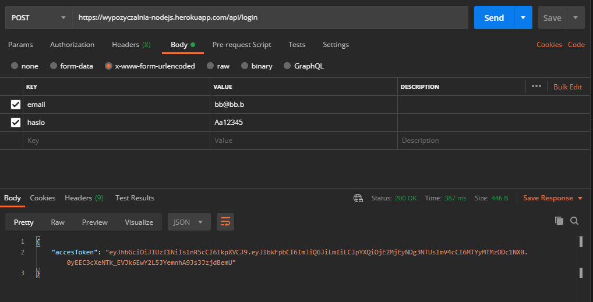
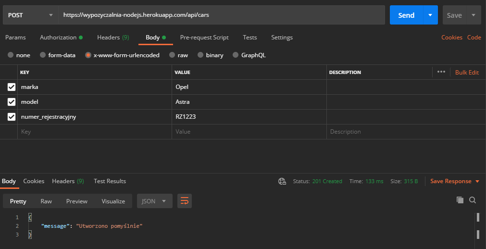
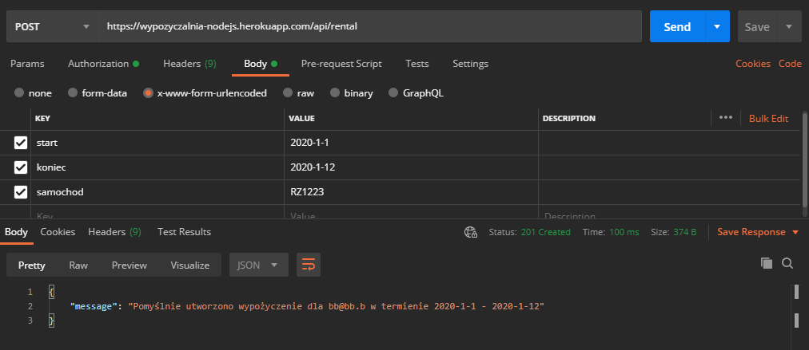
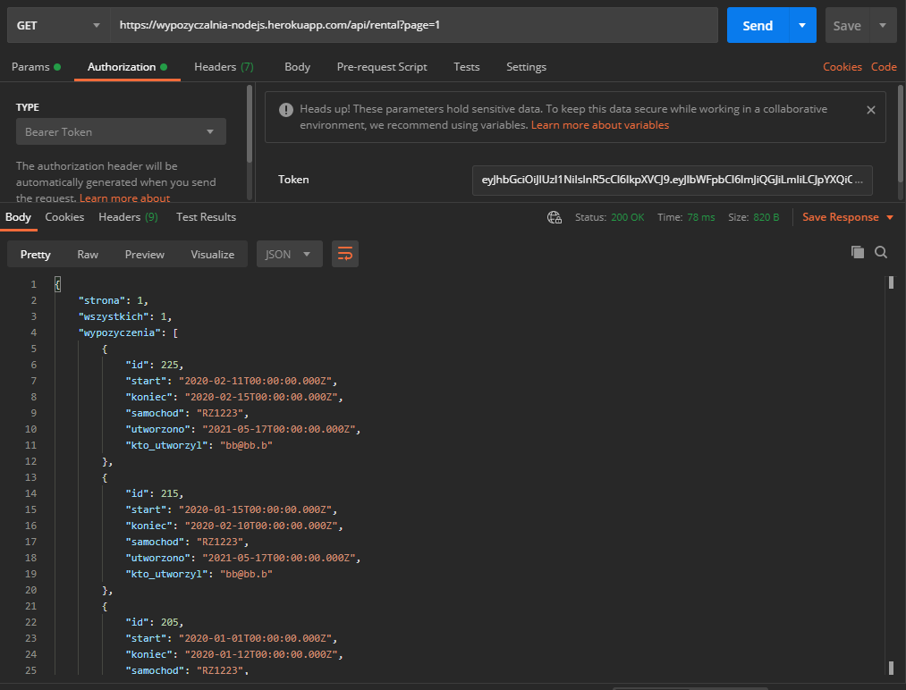
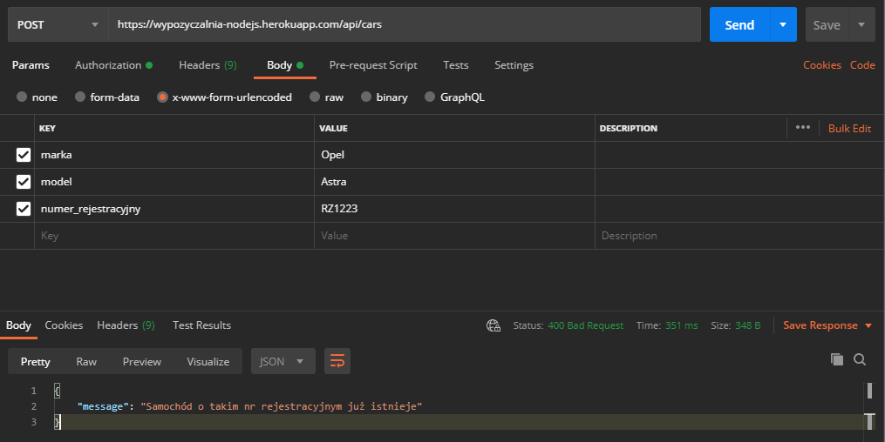
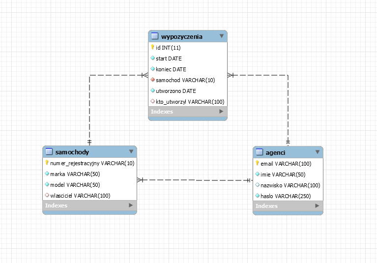

# Wypożyczalnia

## projekt zrobiony w node.js

### Zgodnie z założeniami, projekt umożliwia akcje:
- Rejstracja
- Logowanie
- Dodanie zamochodu
- Utworzenie wypożyczenia
- Pobranie dodanych wypożyczeń

# Api wykorzystuje JWT Bearer Token oraz zostało podzielone na 4 endpointy:

# /register
## POST

| parametr     |
|--------------|
| email*       |
| imie*        |
| nazwisko     |
| haslo*       |
| powtorzhaslo* |

*-  parametr wymagany

### Przykład użycia:

# /login
## POST

| parametr     |
|--------------|
|email*|
| haslo*|

*-  parametr wymagany

### Przykład użycia:

# /cars
## POST

| parametr     | 
|--------------|
|marka*|
|model*|
|numer_rejestracyjny*|

*-  parametr wymagany

### Przykład użycia:

# /rental

## POST
| parametr     ||
|--------------|--|
|start*|data w formacie rrrr-mm-dd|
|koniec*|data w formacie rrrr-mm-dd|
|samochod*| numer rejestracyjny pojazdu|

*-  parametr wymagany

### Przykład użycia:

## GET
|parametr||
|--|-|
|page|nr strony|

*-  parametr wymagany

# Przykładowe błędy:

# Schemat ERD Bazy danych

